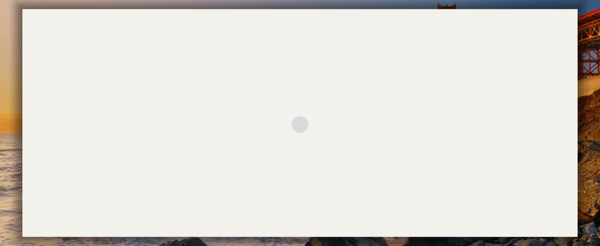

<h1 align="center">bob</h1>

<p align="center">24 morphing character faces built from a Figma file and a little dream.</p>

<p align="center"></p>

## The package

Pull it into any React project from npm:

```bash
npm install @sloemo/bob    # the plain name "bob" is taken on the registry
```

```jsx
import { Bob } from "@sloemo/bob";

<Bob size={320} />
```

That is the whole character in one element: 24 morphing faces, live eyes, the
morph engine, `Stage`, and `data.json`, with prebuilt ESM and CJS bundles in
the tarball. React (18 or 19) is the only peer dependency. The same code also
lives at `component/` in this repo; use it directly if you prefer vendoring:

```jsx
import { Bob } from "./component/src";                 // from this repo
// or the prebuilt ESM bundle: import { Bob } from "./component/dist/bob.js";
```

Props (`size`, `face`, `hold`, `body`, `paused`, `onFace`, ...), the ref handle
(`goto`, `advance`, `toggle`, `snapshot`) and the TypeScript types
(`component/index.d.ts`) are documented in [`component/README.md`](component/README.md).
There is a no-build example page too:

    node component/example/serve.mjs     # http://127.0.0.1:5184/example/

Rebuild the bundle after changing anything under `component/src` with
`./component/build.sh`.

## How it works

Every transition between faces is a real SVG path morph. Each shape of face A
is paired with a shape of face B (eyes, pupils, dots, accessories) and the
path geometry is interpolated point by point; there are no opacity crossfades,
and a shape with no counterpart collapses to a point and grows back out of
one.

Pairing runs in three tiers. A hand-written override table pins the reads that
matter: the wink closing into a sleepy arc, the X-eyes unfolding out of the
typing dots, the blush cheeks merging into the tear (one cheek staggered so
two blobs never mush mid-flight), the prompt glyphs folding into the eyes.
Whatever is left pairs by nearest centroid, and a family gate keeps the
semantic neighbours together: a pupil may only take an eye-family lid, on its
own side, and eyes and pupils keep their canonical paint order so a lid never
ends up over the pupil it should sit under. Leftover shapes of a
single-graphic family (book, magnifier, check, ...) auto-merge into the
nearest paired sibling instead of dying in place.

Shapes are classified before pairing, because how they render flips with the
classification: an opaque fill region grows by half its stroke width, a
stroke keeps its centerline with a lerped width, and a fill meeting a stroke
converts the stroked side to its real outline so the representation never
swaps mid-flight. Ring pairs render in two phases: align and scale the source
ring onto the target's frame first, then resolve the shape, with cubic ramps
meeting at matched velocity. Every shape lands pixel-true on the next hold
pose; the handoff diff is edge antialiasing only.

Held faces are not still. Eyes saccade and blink, the typing dots bounce, the
timer hand ticks (thirty degrees per seven hundred milliseconds, with a two
degree wind-up and a snap on landing), the pens rock on their nibs, the Z's
float, and face 1's idle rove sweeps a range bounded by its own eye geometry.
Each one is computed from the clock inside the hold, frozen to the pose the
screen actually shows the instant a morph takes over, and targeted back to
the loop's start pose when a morph enters the face, so both boundaries of a
hold are seamless.

- `component/src/engine/clock.js` the state machine: holds, morphs, eye
  saccades and blinks, and the held micro-animations
- `component/src/engine/morph.js` shape pairing, classification and the
  interpolation
- `component/src/engine/geom.js` path and colour helpers
- `component/src/components/Stage.jsx` the SVG stage
- `component/src/components/Bob.jsx` the React element (props, ref, rAF loop)
- `component/src/data.json` generated from the Figma exports
  (`python3 build.py --json`)

Bodies: the face sits on a plain disc by default, and nine more silhouettes
(cloud, square, hexagon, pebble, triangle, starburst, diamond, trigon,
droplet) are selectable via the `body` prop. Every body is a 240-point ring
aligned to the circle's parameterisation, so any pair blends with one
point-to-point lerp, and the stage fits each frame from the morphing ring's
own bounds, so a body morph can never poke past the viewBox. Some faces
recolour the body they sit on (face 12's red takes over every shape), and the
coloured marks (the tick, the red X, the warn amber) stay readable on all ten.

## The single-file build

`index.html` is the whole character in one generated file; open it directly in
a browser. It takes the same query params used for capture and testing:

- `?face=N` start at face N (1-24)
- `?only=2,3,5` restrict the auto-cycle to a subset
- `?hold=ms` fixed hold time per face
- `still=1` freeze the exact resting pose of that face (used by compare.py)
- `ff=ms` fast-forward the animation N ms at load (deterministic state capture)

Controls: `←` / `→` step faces, `space` pauses, click advances.

- `build.py` regenerates `index.html` from `assets/faces/*.svg` plus the
  embedded engine, and `python3 build.py --json` regenerates
  `component/src/data.json`
- `compare.py` renders every face headless (`?face=N&still=1`) and diffs it
  against the Figma screenshot of that frame; writes `assets/render/pair_NN.png`
  (left = build, right = Figma) and prints a mean-diff table

## typebob

`typebob/` is the typing scene: bob types a paragraph character by character,
switching faces as the words land, and when the last period arrives he folds
into it, rests, then lifts off to the next paragraph. It ships two ways, both
in this repo:

- the **app** (`typebob/`), a Vite + React page that runs the scene full-bleed
- the **component** (`typebob/component/`), the same scene as a drop-in React
  component, packaged for npm as `@sloemo/typebob`:

```bash
npm install @sloemo/typebob
```

```jsx
import { Typebob } from "@sloemo/typebob";

<div style={{ width: "100%", height: 420 }}>
  <Typebob paragraphs={["your own words.", "and a second one."]} />
</div>
```

Props (`paragraphs`, `cps`, `body`, `tour`, `paused`, `onParagraph`, ...) and
the ref handle are documented in
[`typebob/component/README.md`](typebob/component/README.md). The app runs with:

    cd typebob && npm install && npm run dev -- --port 5175

Details in [`typebob/README.md`](typebob/README.md).

## Files

- `index.html` the single-file build (self-contained, generated)
- `build.py` regenerates `index.html` and `component/src/data.json`
- `compare.py` the still-comparison harness
- `component/` the npm package (`@sloemo/bob`)
- `typebob/` the typing app + `typebob/component/` (the npm package `@sloemo/typebob`)
- `assets/faces/` per-face SVG exports from the Figma file
- `assets/shots/` per-face PNG screenshots from Figma (ground truth)
- `assets/render/` headless renders, pair strips, contact sheets

## Notes

- Face 3's spinner keeps the Figma arrangement; only its motion (spin, chase,
  depth) is animated. All other faces are pixel-matched to their Figma frames.

## License

MIT. See [LICENSE](LICENSE).
